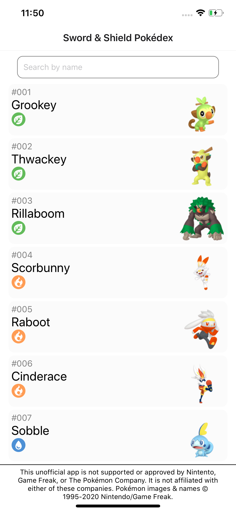
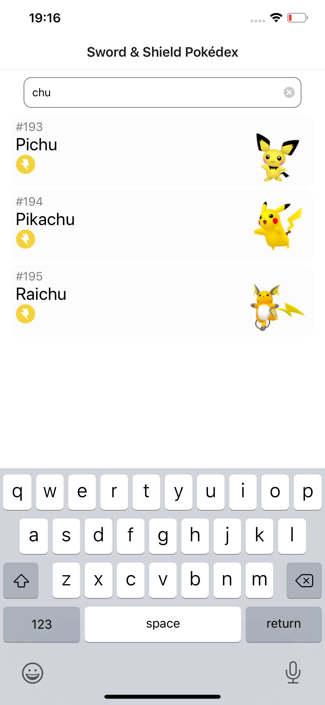
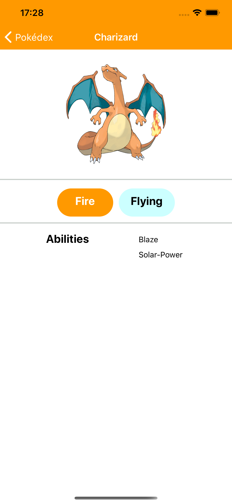

# React-Native Pokédex

A small side-project which uses
* TypeScript
* React-Native
* PokemonDB
* Detox
* React-native-testing-library
* Jest

To create a Pokedex app for iOS & Android.

## Home
Displays a list of Pokémon available in Sword & Shield

## Search
You can search for a Pokémon by name

## Details
You can view a Pokémon's details

## Pre-requisites
1. Ensure your development environment is configured (For React Native CLI) as detailed [here](https://reactnative.dev/docs/environment-setup) for both iOS and Android development
2. Install Detox CLI
3. Install Python
4. Install `yarn`

## Running the app
1. `yarn install`
2. `yarn ios`

## Running the unit tests
1. `yarn install`
2. `yarn run test:unit`

## Running E2E Tests
To run the E2E Detox tests you'll have to do a bit of setup which can be found on [this](https://blog.expo.io/testing-expo-apps-with-detox-and-react-native-testing-library-7fbdbb82ac87) blog post. In summary you'll need to do the following:
1. `yarn install`
2. `brew tap wix/brew`
3. `brew install --HEAD applesimutils`
4. `npm install -g detox-cli`
and then you're good to go! Detox has already been configured to run with Expo and TypeScript in this project.

To run the tests just execute `yarn run test:all`, this will run multiple jobs and do the following:
1. Run unit tests
2. Compile the android app
3. Load the android app onto the emulator and run detox tests
4. Compile the iOS app
5. Load the iOS app onto the simulator and run detox tests

The tests have been configured to output logs, videos and screenshots to the `e2e/artifacts` directory.

Pokémon and Pokémon character names are trademarks of Nintendo. I do not (and nor do I claim to) own the Pokémon property.

App design & implementation © Samuel Barker, 2020