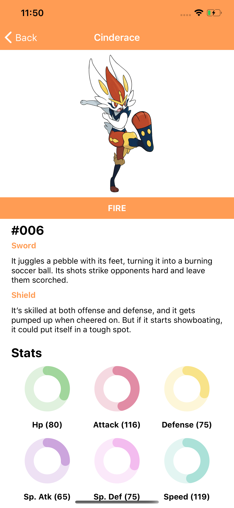

# React-Native Expo Pokédex

A small side-project which uses
* TypeScript
* React-Native
* Expo
* PokeAPI
* PokemonDB
* Detox
* React-native-testing-library
* Jest

To create a Pokedex app for iOS.

## Home
Displays a list of Pokémon available in Sword & Shield

## Search
You can search for a Pokémon by name

## Details
You can view a Pokémon's details

## Pre-requisites
1. NodeJS installed
2. NPM installed
3. Brew installed
4. Python installed

## Running E2E Tests
To run the E2E Detox tests you'll have to do a bit of setup which can be found on [this](https://blog.expo.io/testing-expo-apps-with-detox-and-react-native-testing-library-7fbdbb82ac87) blog post. In summary you'll need to do the following:
1. `brew tap wix/brew`
2. `brew install --HEAD applesimutils`
3. `npm install -g detox-cli`
and then you're good to go! Detox has already been configured to run with Expo and TypeScript in this project.

To run the tests just execute `npm run test:e2e`, this will run multiple jobs and do the following:
1. Pull the latest expo app and fire it up on the device
2. Sideload the pokedex app in the simulator
3. Execute the tests

Code coverage is difficult at the moment as getting `ts-jest`, `expo` and `react-native` to work together is tricky.

However, the tests have been configured to output logs, videos and screenshots to the `e2e/artifacts/ios` directory.

Pokémon and Pokémon character names are trademarks of Nintendo. I do not (and nor do I claim to) own the Pokémon property.